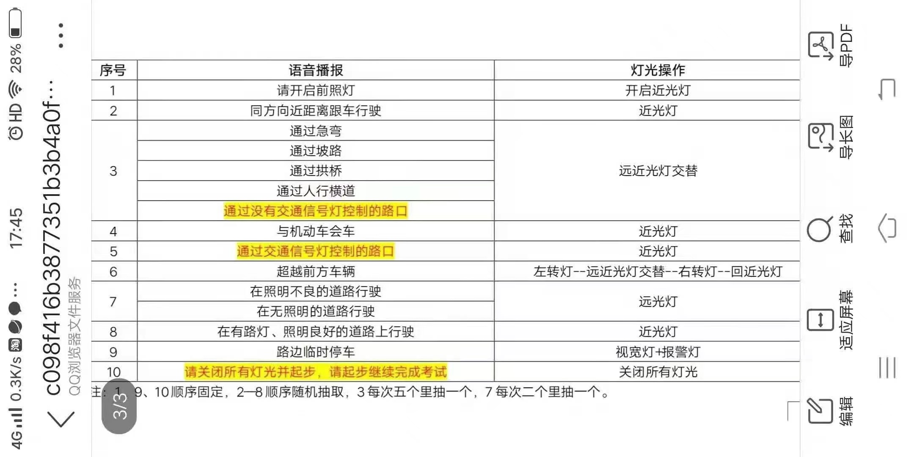

# 科三

> 起步，转向，超车，变道，转弯， 掉头，都应开启转向灯，3s后再动方向盘； 
> 踩刹车，路口等控制速度在20km/h

#### 起步
左转向灯，3s后，踩刹车，挂D挡，松手刹

#### 路口右转
右转向灯，刹车，人行横道过后，右转

#### 路口直行
刹车至20km/h

#### 超车
踩刹车，停车，左转向灯，3s后左变道，摆正方向盘，右转向灯，3s后右转向，关闭转向灯

#### 直线行驶
30km/h

#### 变更车道
左转向灯，3s后动方向盘

#### 掉头
左转向灯，刹车

#### 百米加速
50km/h

#### 路口左转
左转向灯，刹车，人行横道过后，左转

#### 会车
20km/h, 车身与右侧边缘线，30km/h~60km/h, 直线行驶

#### 公交车站
20km/h, 过标牌，刹车，

#### 学校
20km/h, 过标牌，刹车，

#### 人行横道
20km/h, 刹车

#### 靠边停车
右转向灯，3s后右方向盘，左方向盘拉正车身，一指宽时停车，与路边距30cm, P档，手刹，安全带，开门，关门

