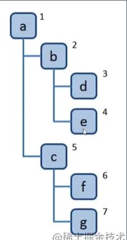
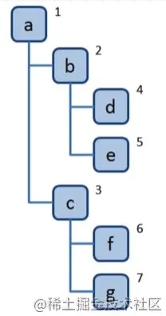

# 数据结构与算法
## 栈
**先进后出** 的数据结构
- js中没有栈,可以用Array实现对栈的所有功能

```javascript
    let arr = [];
    // 进栈
    arr.push(1); 
    arr.push(2);
    // 出栈
    arr.pop();
    arr.pop(); 
```

### 应用    
- js中基本数据类型存储栈内存中
- js执行时有执行栈,事件循环中将以次执行执行栈中的回调

## 队列
**先进先出**  的数据结构
- js中没有队列,但是可以用Array实现对队列的所有功能

```javascript
    let arr = [];
    // 进栈
    arr.push(1); 
    arr.push(2);
    // 出栈
    arr.shift();
    arr.shift();
```

### 应用
- 食堂排队打饭
- 所有先进先出的场景
- js 异步中的任务队列

## 链表
- 多个元素组成的列表
- 匀速存储不连续, 用next指针连在一起

### 数组vs链表
- 数组:增删非首尾元素是往往需要移动元素
- 链表:增删非首尾元素,不需要移动元素,只需要更改next指针即可

### js中的链表
- js没有链表的数据结构
- 可以用Object模拟链表

```javascript
const a = { val: 'a' }
const b = { val: 'b' }
const c = { val: 'c' }
const d = { val: 'd' }
a.next = b
b.next = c
c.next = d

// 遍历
let point = a
while (point) {
    console.log(point.val)
    point = point.next
}

// 插入: (c-d)中插入d

const e = {val:'e'}
c.next = e
e.next = d


// 删除 (删除e)
c.next = d
```

## 集合
- 一种无序且唯一的数据结构
- ES6中有集合, 名为Set
- 集合常用操作: 去重,判断某元素是否在集合中,求交集

## 字典
- 与集合相似, 字典也是一种存储为一值的数据结构, 但他是以键值对的形式存储
- ES6中有字典-->Map(映射)
- 常见操作： 增(set) 删(delete) 改(set) 查(get)

## 树
- 一种分层数据的抽象模型
- 前端工作中常见的树包括:DOM树,级联选择,树形控件....
- js中没有树,但是可以用Array 和Object构建树
- 树的常用操作: 深度/广度优先遍历 , 先中后序遍历

#### 几个概念
- 拥有相同父节点的节点,互称为兄弟节点
- 节点的深度: 从根节点到该节点所经历的边的个数
- 节点的高度: 节点到叶节点的最长路径

#### 注意点
- 仅有唯一一个根节点，没有节点则为空树
- 除根节点外，每个节点都有并仅有唯一一个父节点
- 节点间不能形成闭环

#### 树的深度优先遍历
尽可能深的搜索树的分支:递归
- 访问根节点
- 对根节点的children挨个进行深度优先遍历



```javascript
const tree = {
  val: 'a',
  children: [
    {
      val: 'b',
      children: [ 
            { val: 'd', children: [ ] },
            { val: 'e', children: [ ] }
      ]
    },
    {
      val: 'c',
      children: [
            { val: 'f', children: [ ] },
            { val: 'g', children: [ ] }
      ]
    }
  ]
}
const dfs =(root) => {
  console.log(root.val)
  root.children.forEach(dfs)
}

dfs(tree)
// a
// b
// d
// e
// c
// f
// g
```

#### 树的广度优先遍历
先访问离根节点最近的节点
1. 新建一个队列, 把根节点入队
2. 把队头出队并访问
3. 把对头的children挨个入队
4. 重复第二,第三,直到队列为空



```javascript
const bfc = (root) => {
  const q = [root]
  while (q.length > 0) {
    const n = q.shift()
    console.log(n.val)
    n.children.forEach(child => {
      q.push(child)
    })
  }
}
bfc(tree)
// a
// b
// c
// d
// e
// f
// g
```
