# 不简单的console

还只会console.log吗？虽然一个打印输出就能解决很多问题。

但是如果你仅仅只是了解这一个那就挺可惜了，错过了那些有助于调高开发效率的功能。

今天我们列举一些常用又可以提高开发效率的其他功能。

## 基本打印
### console.log()

这应该是我们最常用的功能，基本上每天都会使用到，作用也很简单，在控制台输出内容，这边有个小技巧。

假设你有多个变量需要输出，如果直接输出，不方便查看对应名称，可以添加一个中括号，可以更直观的查看变量对应。

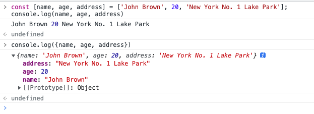

### console.warn()

控制台输出警告信息，用法和console.log是完全一样的，只是显示的样式不太一样，信息最前面加一个黄色三角;

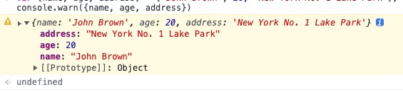

### console.error()

控制台输出错误信息，用法和console.log是完全一样的，只是显示的样式不太一样

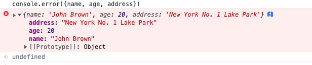

> console.exception() 是 console.error() 的别名，它们功能是相同的

### console.info()

打印资讯类说明信息，它和console.log()的用法一致，打印出来的效果也是一样

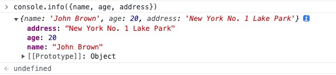

## 打印时间
### console.time() & console.timeEnd()

这两个方法一般是配合使用，用于计算代码段的执行时间，有助于性能调试和判断。

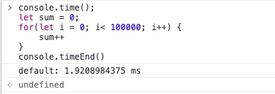

### console.timeLog()

## 分组打印
### console.group() & console.groupEnd() & console.groupCollapsed()

打印特别多的信息时，可能页面的数据过多无法快速准确的定位我们想要的信息。

- console.group()和console.groudEnd()，默认展开的
- console.groupCollapsed()和console.groudEnd(), 默认折叠

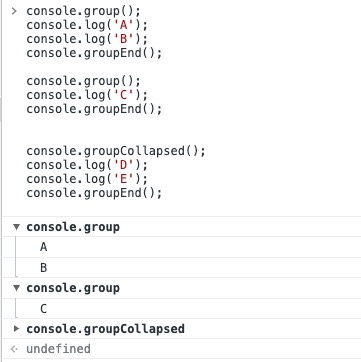

## 计数
### console.count() & console.countReset()

输出 count() 被调用的次数。此函数接受一个可选参数 label，如果你不设置参数的话，这个参数默认名叫**“default”**。

countReset()会重置计数

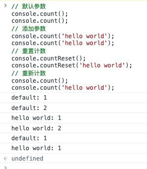

## 其他
### console.table()

可以方便的打印数组对象的属性，打印结果是一个表格。

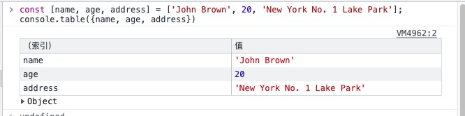

有两个参数，第一个参数是需要打印的对象，第二个参数是需要打印的表格的标题，这里就是数组对象的属性值。

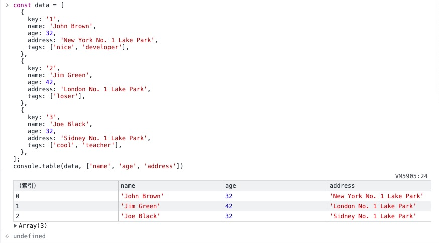

### console.clear()

清除控制台，当然我们完全可以使用控制台的清除键

### console.dir()

输出DOM节点对应的js对象映射，可以查看DOM的相关事件和属性

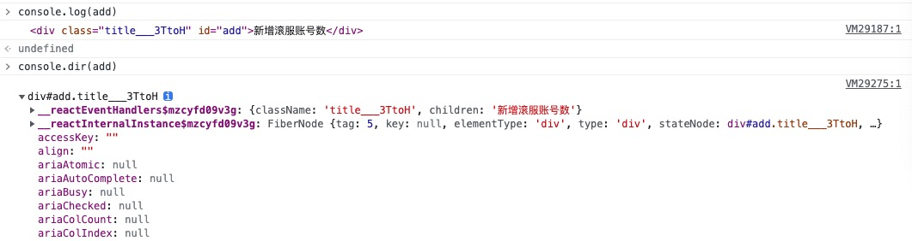

### console.assert()

有两个参，第一个参会被解析成Boolean，为false时，打印第二个参数。

可以减少书写判断逻辑，用于判断空值或者false逻辑还是很有用处的。

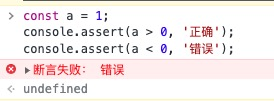

### console.trace()

向 Web 控制台 输出一个堆栈跟踪

可以看到，这里输出了调用栈的信息：c→b→a，这个堆栈信息是从调用位置开始的。

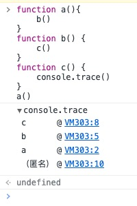

### console.memory

console.memory是console对象的一个属性，而不是一个方法。它可以用来查看当前内存的使用情况，如果使用过多的console.log()会占用较多的内存，导致浏览器出现卡顿情况。

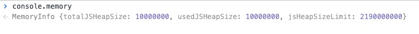

