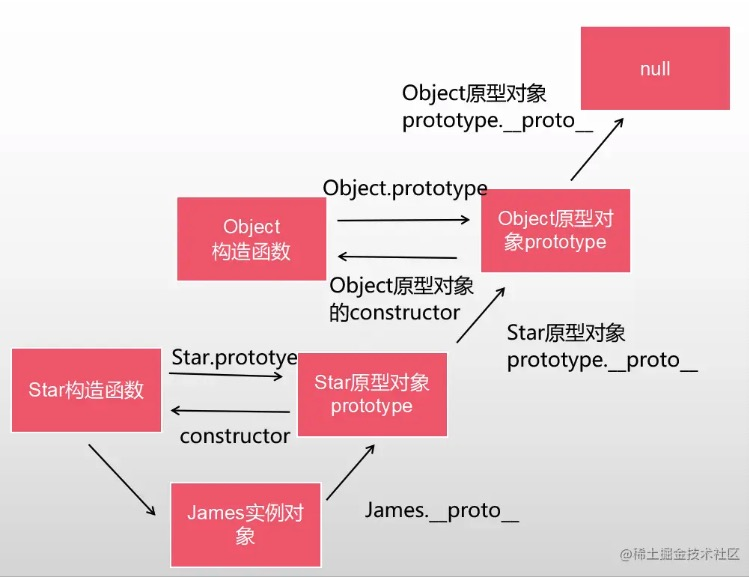

# 原型，构造函数，实例

## 创建对象
1. new Object()
```javascript
let obj = new Object()
```
2. 对象字面量
```javascript
let obj = {}
```
3. 构造函数Constructor
```javascript
function Star(name,age){ 
  this.name=name,
  this.age=age,
  this.play=function(){
    console.log('我打球贼厉害')
  }
}
var James = new Star('詹姆斯'，37);
```

## 构造函数
- 构造函数用于创建对象时，函数名首字母大写
- 构造函数要和new一起用才有意义

## new在执行时做了什么
1. 在内存中创建一个空的对象
2. 设置原型，将对象的原型设置为函数的prototype对象
3. 让this指向这个新的对象，执行构造函数里面的代码，给这个新对象添加属性和方法
4. 判断函数的返回值类型，如果是值类型，返回创建的对象。如果是引用类型，就返回这个引用类型的对象（所以构造函数里面不要return）

## 原型
- 每一个构造函数都有一个prototype属性，指向另一个对象。
- 这里的prototype就是一个对象，这个对象所有的属性和方法，都会被构造函数所拥有。

## 原型链
1. 当访问一个对象的属性(包括方法)时，首先查找这个对象自身有没有该属性。
2. 如果没有就查找它的原型(也就是__proto__ 指向的prototype原型对象)。 
3. 如果还没有就查找原型对象的原型( Object的原型对象)。
4. 依此类推一直找到Object为止 ( null)。

## 实例
- new 生成的对象叫实例
- 实例的__proto__，指向原型对象

## 关系示例

```javascript
// 构造函数
function Star(name, age) {
  this.name = name;
  this.age = age;
}

// 原型
Star.prototype.play = function () {
  console.log('我打球很厉害！')
};

// 实例
var James = new Star(1, 2);

// 实例的__proto__指向原型
James.__proto__ === Star.prototype // true
// 原型的constructor指向构造函数
Star.prototype.constructor === Star // true
// 实例对象可以继承原型对象的constructor属性
James.constructor === Star // true

// 原型对象里的__proto__ 指向Object.prototype
Star.prototype.__proto__ === Object.prototype // true
// Object.prototype的__proto__ 最终指向null
Object.prototype.__proto__ === null // true
```
